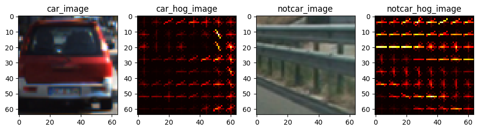
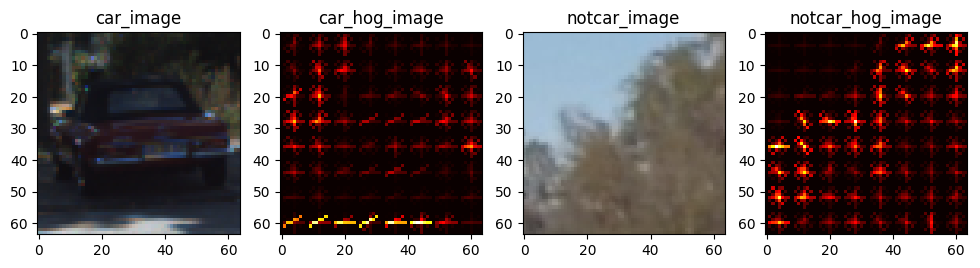
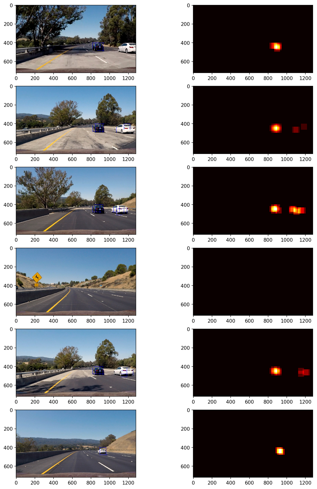
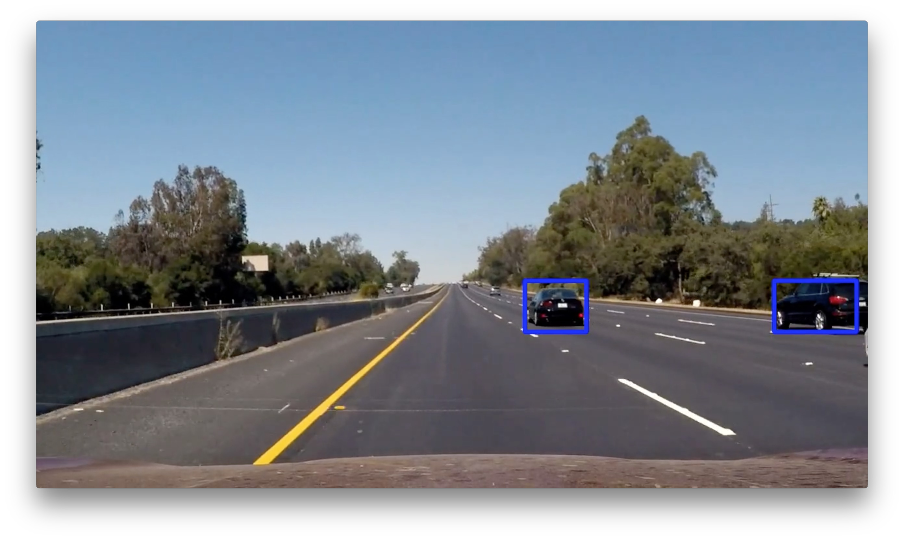

## Vehicle Detection Project

The goals / steps of this project are the following:

* Perform a Histogram of Oriented Gradients (HOG) feature extraction on a labeled training set of images and train a classifier Linear SVM classifier
* Optionally, you can also apply a color transform and append binned color features, as well as histograms of color, to your HOG feature vector.
* Note: for those first two steps don't forget to normalize your features and randomize a selection for training and testing.
* Implement a sliding-window technique and use your trained classifier to search for vehicles in images.
* Run your pipeline on a video stream (start with the test_video.mp4 and later implement on full project_video.mp4) and create a heat map of recurring detections frame by frame to reject outliers and follow detected vehicles.
* Estimate a bounding box for vehicles detected.

#### 1. Provide a Writeup / README that includes all the rubric points and how you addressed each one.

You're reading it! Jupyter Notebook `main.ipynb` is used to finish the project.

### Histogram of Oriented Gradients (HOG)

#### 1. Explain how (and identify where in your code) you extracted HOG features from the training images.

The code for this step is contained in the `second` code cell of the IPython notebook called `get_hog_features`

In the `first` code cell, I started by reading in all the `vehicle` and `non-vehicle` images.  Here is an example of one of each of the `vehicle` and `non-vehicle` classes:

I then explored different color spaces and different `skimage.hog()` parameters (`orientations`, `pixels_per_cell`, and `cells_per_block`).  I grabbed random images from each of the two classes and displayed them to get a feel for what the `skimage.hog()` output looks like.

Here is an example using the `RGB` color space and HOG parameters of `orientations=6`, `pixels_per_cell=(8, 8)` and `cells_per_block=(2, 2)`:

#### 2. Explain how you settled on your final choice of HOG parameters.

I tried various combinations of parameters:

`color_space = 'HSV','HLS','LUV','YCrCb'`

`orientation = 6,8,9`

`pix_per_cell = 6,8`

`cells_per_block = 2,4`

In the end, I decided to settle down with the common parameters that are introduced in the course with only the color_space changed from `RGB` to `YCrCb`.

#### 3. Describe how (and identify where in your code) you trained a classifier using your selected HOG features (and color features if you used them).

In code cell `No.3-5`, I trained a linear SVM `LinearSVC` using the `YCrCb` color space and HOG parameters of `orientations=6`, `pixels_per_cell=(8, 8)` and `cells_per_block=(2, 2)` as you can see from the beginning of code cell `3`.

Also, `spatial_size = (16, 16)` and `hist_bins = 16` are used for color histogram feature and spatial binning feature.

The length of the training vector was **4344**.

It took **118.966s** to extract the features from both categories and **13.674s** to train on the provided dataset.

SVC score on the randomly split testset was **0.9904279**.

### Sliding Window Search

#### 1. Describe how (and identify where in your code) you implemented a sliding window search.  How did you decide what scales to search and how much to overlap windows?

In code cell `No.2`, I implemented a sliding window search with a size of 64x64 pixels each with an overlap of 50% between adjacent windows in both the vertical and horizontal dimensions.

I tried various combinations of parameters:

`size = 32x32,96x96,128x128`

`overlap = 25%,75%`

#### 2. Show some examples of test images to demonstrate how your pipeline is working.  What did you do to optimize the performance of your classifier?

**Yes exactly like this.** Ultimately I searched on two scales using YCrCb 3-channel HOG features plus spatially binned color and histograms of color in the feature vector, which provided a nice result.  Here are some example images:

---

### Video Implementation

#### 1. Provide a link to your final video output.  Your pipeline should perform reasonably well on the entire project video (somewhat wobbly or unstable bounding boxes are ok as long as you are identifying the vehicles most of the time with minimal false positives.)

Here's [my video output](https://youtu.be/-VajSIj0qTs)

#### 2. Describe how (and identify where in your code) you implemented some kind of filter for false positives and some method for combining overlapping bounding boxes.

**Yes exactly like this.** In code cell `No.7-8`, I recorded the positions of positive detections in each frame of the video.  From the positive detections I created a heatmap and then thresholded that map to identify vehicle positions.  I then used `scipy.ndimage.measurements.label()` to identify individual blobs in the heatmap.  I then assumed each blob corresponded to a vehicle.  I constructed bounding boxes to cover the area of each blob detected.  

#### Here's an example result showing the heatmap from a series of frames of video and the bounding boxes then overlaid on the last frame of video:

#### Here the resulting bounding boxes are drawn onto the last frame of video:

